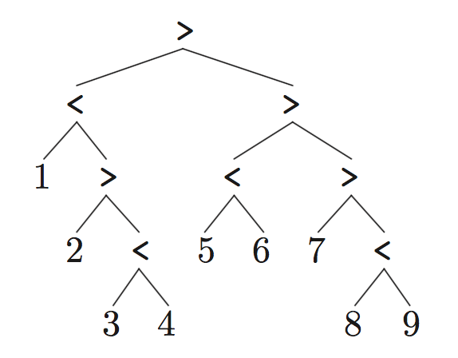
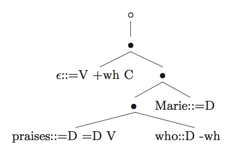
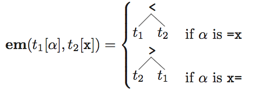

# Computational perspectives on minimalism

#### Stabler, E. (2010). Computational perspectives on minimalism. In _Oxford Handbook of Linguistic Minimalism_, C. Boeckx ed. Oxford Press, pp. 616-641.

#### Notes by Eva Portelance, May 25, 2017

# Minimalist Grammar Variants

## Minimalist Grammars (MGs)

### Review

MG is composed of:
* Lexicon (finite set of lexical items)
* Merge structure building operations (Stabler: em and im)
* Set of features

Features
* 3 types: syntactic, semantic, phonetic
* 4 types of syntactic features:
    * categoral: syntactic category of head (e.g. d)
    * selector: for merge (another category the head attracts, e.g =d)
    * licensor: for move (landing projection, eg. +case, +wh)
    * licensee: for move (moving projection, eg. -case, -wh)

Lexicon
* lexical item: a sequence of features. eg. =n, d, -case, /ɛvɹi/, EVERY}
* usual notation: (non-syntactic)    Phon :: f1, f2, ... , fn     (syntactic features)
* phonological feat can be 𝜖 (functional heads)

### Bare phrase structure

"...the important insight of X-bar syntax is a relational one: a head X determines certain relevant properties of the XP it is the head of. "

Merge according to Chomsky (1995:245):
   $$ merge(\alpha , \beta  ) -> \{ \alpha ,\{ \alpha,\beta \}\} $$
Represented by the following unordered tree:
  

Or using < and > as pointers towards each maximal projections head:
  

* leaves: lexical items reduced to only their syntactic features (no distinction between overt and covert movement)
* linear order determined locally
* Eg. the linear order is 123456789 and the head of the tree is 8.
  

* maximal projection: subtree which is not part of any larger subtree with the same head. eg. 234

### Merge: First version

* The lexicon provides labels for 1-node trees (i.e. we always merge trees)

* **external merge (em) = merge**
  * 2 trees merge
  * uses selector features, eg.
    

  * em defined as:
    

  * where the top is merging a complement and the bottom a specifier.
  * this definition allows for 1 complement and multiple specifiers.

* **internal merge (im) = move**
  * applies to 1 tree
  * uses licensee features, eg.
    

  * im must satisfy the Shortest Move Constraint (SMC) to apply to *t*[+x]
    * **SMC** : Exactly one head in the tree has -x as its first feature.
  * im defined as:
    

* Example derivation:
  * Lexicon
    

  * Apply merge (em, im)
    

  * The derivation tree
    

### MGs and other formalisms

  

* MG definable languages include:
  * finite (Fin)
  * regular (Reg)
  * context free (CF)
* MG definable languages are properly included in:
  * context sensitive (CS)
  * recursive (Rec)
  * recursively enumerable (RE)

Theorem 1.

- TAG: tree adjoining grammars
- CCG: categorial combinatory grammars
- MCFG: multiple context free grammars
- LCFRS: linear context free rewrite systems

## Conflated Minimalist Grammars (CMGs)

### Conflated and persistent features

* conflate licensee and category features, eg. a V selects a D and a T might move that same D using a -D.
* can reduce size of Lexicon.
* introduce persistent features, that are not removed when checked (to possibly be checked more than once).
  * persistent features are underlined
  * if features are ordered this can cause a problem by blocking access to features which follow a persistent one.
    * proposed solutions: unordered features or ordered features, but merge can optionally erase persistent features.

* change the definition of Merge
  

* example derivation:
  * lexicon
  

  * derivation tree and final tree
  

  * X' tree for comparison
  

Theorem 2.
$$ CMG \equiv MG $$

## Phase-based Minimalist Grammars (PMGs)

### Phases

* categories which make everything in their complement invisible to syntactic operations (eg. v and C)
* follows: nothing can affect the linear order of the complement of a phase.
* Phase Impenetrability Condition (PIC): Merge cannot apply to a tree *t*[*f*] if *f* is a phase and if the complement of the head of *t*[*f*] has any syntactic features.
  * restricts em and im
  * PIC can also be imposed on CMGs, giving Phase-based Conflated Minimalist Grammars (PCMGs)

Theorem 3.
$$ PCMG \equiv CMG \equiv MG $$

## Relativized Minimalist Grammars (RMGs)

### Relativized minimality

* SMC blocks movements where more than one Wh is involved, such as in:
  What_i do you wonder how_j [ to solve t_i t_j ]
* Rizzi's relativized minimality:
  * wh-phrases, subjects, adverbs, cannot move across another
  * unless in moved to a stressed focus positions
* But if we allow multiple wh-movements and such, we need to control for these constraints as nothing stops us from moving the second wh over the first (once the first's wh feature has been deleted there is nothing in its syntactic features which denotes it as a wh)
* Necessary modifications:
  1. Conflate selectors with licensors and categories with licensees (as in CMGs)
  2. We no longer delete features when checked, but use a dot that moves through the sequence of features when checked. (distinction between persistent and non-persistent still maintained).
    - initially:
    $$ \bullet \alpha_1 \alpha_2 ... \alpha_n $$
    - when feature is checked:
    $$ \alpha_1 \bullet \alpha_2 ... \alpha_n $$
    - when persistent : stays unchanged

  3. Define the Relativized Minimality Condition (RMC)
      let *type* be a function that maps each basic feature *f* to the features that block movement of *t*[*f*] .
      for any subtree $$ t_2 $$ of tree $$ t_1 $$ , let *cover*( $$ t_2 $$ ) be the set of features of heads $$ t_1 $$ (?) such that $$ t_1^M $$ c-commands $$ t_2^M $$ .
      RMC: im applies to $$ t_1[=f] $$ only if
        (i) $$ t_1[=*f*] $$ has exactly one subtree $$ t_2[f] $$
        (ii) $$ cover( t_2[f] ) \cap type(f) = \emptyset $$ .

Theorem 4.
$$ RMG \equiv MG $$

### Multiple movements and multiple agree

* Wh-in-situ: assume a version on Wh item does not have formal feature requiring movement to be checked
* Multiple wh-fronting : SMC or RMC don't allow im to apply to 2 -wh features.
  * Possible solutions:
    * Refine wh-features (wh-nom, wh-acc, wh-manner... )
    * Introduce clustering/absorption case of merge, which merge two phrases with the same first feature together.
    * Relax SMC to allow for a more expressive formalisms
* MGs can easily be extended to include feature checking without movement.

## Directional Minimalist Grammars (DMGs)

### Linearization

* The current definitions of merge only account for 'SVO'
* Change the definition of em to account for different orders. =x feature attaches to the left, x=, to the right:
    

Theorem 5.
$$ DMG \equiv MG $$

* Different orders can also be derived with movement
* Using MGs to provide evidence about language universals
  * Given a sequence 1234, only 16 of the 24 possible permutations are derivable using MGs (with less than 4 applications of im)
  * Cinque (2005) reports that only 14 permutations of [Dem Num Adj N] are observe (all 14 derivable with MGs).
  * He classifies each order according to how often in is attested (0 = unattested, 1= very few, 2 = few, 3 = many, 4 = very many)
  * Stabler classifies them for MG and DMG models (4 - *l*), where *l* is the number of licensees needed to derive the order.

    

    * Pearson correlation coefficient:
      - Cinque and MG: 0.62
      - Cinque and DMG: 0.75
    * DMG fits typological data without assumption of rigid SVO order

## More possible variations

* Head movement
  * Can be accounted for with simple extensions (example in notes on Harkema 2001)
  * Weakly equivalent to MGs

* LF and PF movements
  * Merge does not affect linear order and only syntactic features move
  * PF movement for phonetic features
  * LF movement for semantic features

* Adjunct merge
  * adding another merge operation for adjunction

* Sideward movement
  * allow elements to move between two trees which are not merged (no longer just internal move)

* Copy and delete
  * Merge:
    1. em stays unchanged
    2. 

  * The generative power of MGs with copying (MGCs) depends on the nature of function g - If g maps everything to the empty tree, then equivalent to MGs. If g maps to an identical tree except the phonetic and semantic features stay in-situ, then the MGC are not to MGs.

  Theorem 6.
  
