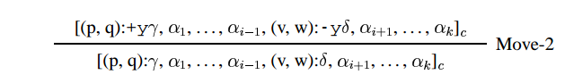

# Parsing Minimalist Languages bottom-up

#### Harkema, Hendrik (2001). "Parsing Minimalist Languages". PhD thesis. University of California, Los Angeles.

#### Notes by Chris Bruno, May 28, 2017

- We specify a bottom-up recognizer for Minimalist Grammars. This recognizer:
    - is agenda-driven and chart-based
    - is similar to the CKY algorithm for Context-Free languages
    - uses the 'parsing-as-deduction' paradigm
    - is based on the structure building rules for the simplified rendition of Minimalist Grammars.
- The next two chapters specify:
    - a top-down recognizer
    - an Earley recognizer

- Recall the definition of Minimalist Grammars in which the structure-building operations are stated over tuples of chains (the 'simplified' formulation).

    **Reformulation of a Minimalist Grammar.**
    A minimalist grammar G is a pair (**Lexicon**, {**move**, **merge**}):

    * Vocabulary $$\Sigma$$ = {`every`, `some`, `student`, ...}
    * Types $$T$$ = {`::`, `:`}
    * Syntactic features $$F = \text{Selectees} \cup \text{Selectors} \cup \text{Licensors} \cup \text{Licensees}$$
        * Selectees: `C, T, D, N, V, P, ...`
        * Selectors: `=C, =T, =D, =N, =V, =P, ...`
        * Licensors: `+wh, +case, +focus, ...`
        * Licensees: `-wh, -case, -focus, ...`
    * Chains $$C = \Sigma^* \times T \times F^*$$
    * Expressions $$E = C^*$$
    * Lexicon **Lexicon** $$\subseteq \Sigma^* \times \{::\} \times F^*$$, a finite set of 1-node trees
    * Structure building operations:
        * **merge**: $$(E \times E) \to E$$ is the union of the following three functions. For any $$\cdot \in \{:, ::\}, \gamma \in F^*, \delta \in F^+$$ and any chains $$\alpha_1, \ldots, \alpha_k, \iota_1, \ldots, \iota_l$$ (where $$0 \leq k, l$$):

            

        * **move**: $$E \to E$$ is the union of the following two functions. For any $$\gamma \in F^*, \delta \in F^+$$, satisfying the following condition:

            (SMC) none of the chains $$\alpha_1, \ldots, \alpha_{i-1}, \alpha_{i+1}, \ldots, \alpha_k$$ has $$-f$$ as its first feature.

            

# Specification of the bottom-up recognizer

In the parsing-as-deduction paradigm:

- Each formula of the deductive system asserts the existence of a tree $$\tau \in CL(G)$$ with certain properties (to be specified).
- The 'formulas' are actually called 'items'.
- The axioms correspond to lexical items.
- The inference rules correspond to structure-building operations
- There is a priveleged set of items called 'goal items'. If any inference rule leads to a goal item, then the sentence is parsed.

Here we specify:

- the deductive system (axioms, rules, goals)
- the deductive procedure (the algorithm)

## Deductive System

Let $$w = w_1\cdots w_n$$ be an input string and $$G = (V, Cat, Lex, F)$$ be a MG.

**Preliminary definitions.**

- **Item.** An item  has the form $$[\alpha_0, \alpha_1, \ldots, \alpha_m]_t$$ where $$m \leq \vert{}licensees\vert, t \in \{s, c\}$$ and each $$\alpha_i$$ is of the form $$(x_i, y_i):\gamma_i$$ where $$0 \leq x_i \leq y_i \leq n$$ and $$\gamma_i \in Cat^*$$.
- **Narrow Yield.** Define $$Y_n$$ a function from trees to strings:
    - If $$\phi = [_> \tau, v]$$ then
        - $$Y_n(\phi) = Y_n(\tau) \cdot Y_n(v)$$ if $$\tau$$ does not have some feature `-f`
        - $$Y_n(\phi) = Y_n(v)$$ otherwise
    - If $$\phi = [_{\langle} \tau, v]$$ then
        - $$Y_n(\phi) = Y_n(\tau) \cdot Y_n(v)$$ if $$v$$ does not have some feature `-f`
        - $$Y_n(\phi) = Y_n(\tau)$$ otherwise
    - If $$\phi$$ is a simple tree then $$Y_n(\phi) = Y(\phi)$$
- **Interpretation of an item.** $$[(x_0, y_0): \gamma_0, \ldots, (x_m, y_m): \gamma_m]_t$$ asserts that there exists a tree $$\tau \in CL(G)$$ where
    1. If $$t = s$$ then $$\tau$$ is simple. If $$t = c$$ then $$\tau$$ is complex.
    2. $$Label(head(\tau)) = \gamma_0\pi\iota$$ where $$\pi\iota \in P^*I^*$$.
    3. For every $$(x_i, y_i):\gamma_i$$, there is a leaf in $$\tau$$ whose label is $$\gamma_i\pi\iota$$.
    4. Besides the nodes labelled by $$\gamma_i\pi\iota$$, there are no other nodes with syntactic features in $$\tau$$.
    5. If $$\tau_0$$ is the subtree of $$\tau$$ where $$\tau_0$$ is the maximal projection of the node labelled by $$\gamma_i\pi\iota$$ for any $$i$$, then $$Y_n(\tau_0) = w_{x_i + 1}\cdots w_{y_i}$$.
- **Example.** A tree and the item that corresponds to its correct parse:

    

**The deductive system.**

- **Axioms.** For every $$\lambda \in Lex$$ where $$\lambda$$'s syntactic features are $$\gamma \in Cat^*$$ and $$\lambda$$'s phonetic features cover $$w_{i+1}\cdots w_{j}$$ of $$w$$, let the following be an axiom: $$[(i,j): \gamma]_s$$.
- **Goals.** $$[(0, n): $$`c`$$]_s, [(0, n): $$`c`$$]_c$$
- **Rules.** Let $$0 \leq p, q, v, w \leq n; 0 \leq i, k, l \leq m; t, t_1, t_2 \in \{s,  c\}$$.

    

    

## Deductive procedure

1. Initialize:
    - chart to empty set of items
    - agenda to the axioms
2. Repeat until agenda is exhausted:
    - Select an item from the agenda and remove it from the agenda. Call this the *trigger item*.
    - Add the trigger item to the chart (if not already in the chart).
    - If the trigger item was actually added to the chart, generate all items that can be derived by that trigger item and any item in the chart by one application of a rule of inference. Add those items to the agenda.
3. If a goal item is in the chart, the goal is proved (the string is parsed).
