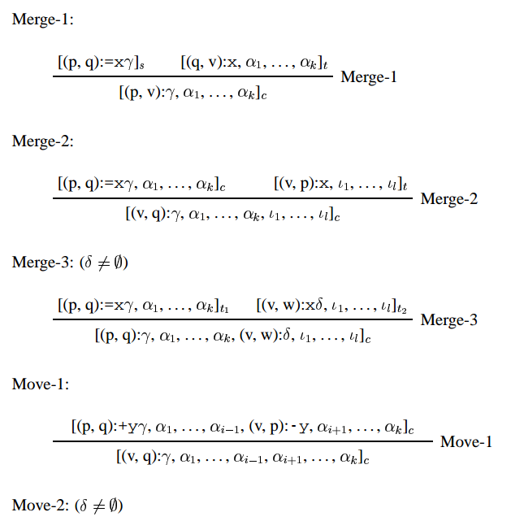

**The deductive system.**

- **Axioms.** For every $$\lambda \in Lex$$ where $$\lambda$$'s syntactic features are $$\gamma \in Cat^* $$ and $$\lambda$$'s phonetic features cover $$w_{i+1}\cdots w_{j}$$ of $$w$$, let the following be an axiom: $$[(i,j): \gamma ] $$ .
- **Goals.** $$[(0, n): $$`c`$$], [(0, n): $$`c`$$] $$
- **Rules.** Let $$0 \leq p, q, v, w \leq n; 0 \leq i, k, l \leq m; t, t_1, t_2 \in \{s,  c\}$$.

    

    

Problems
Merge is always defined as taking 2 chains which rewrite to one chain
Lets assume that a chain always contains only 1 item (p,q): \delta (e.i. k,l = 0),
then we can easily translate merge-1 and merge-2 into Chomsky normal form C -> AB
as we talk about during our last meeting, making the calculation of inside probability straight forward.

$$\displaystyle\beta_A(p, q) = \sum_{B,C \in \mathbf{N}}\sum_{d=p}^{q-1}P(A \to B C)\beta_B(p, d)\beta_C(d+1, q)$$

But in the case of merge-3, the rule takes to chains and rewrites to a chain of length +1, so given two simple chains, we now have a complex one. This is where it gets confusing.
- say the probability is on the item, then the rule is not in Chomsky normal form for the sake of inside probabilities because nothing really merged, we now are just accounting for two separate subtrees in a chain.
- so instead, say the probability is actually that of the chain (let a chain be an item, not just the single subtree) so that the rules have the form C -> AB. Then my issue is understanding how to translate our formula for inside probabilities to an object that is not in a defined order.
