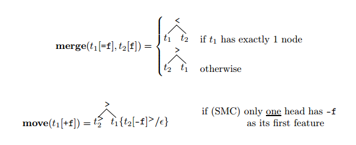
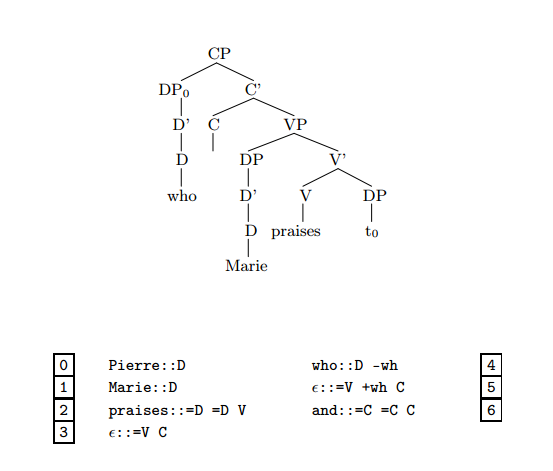
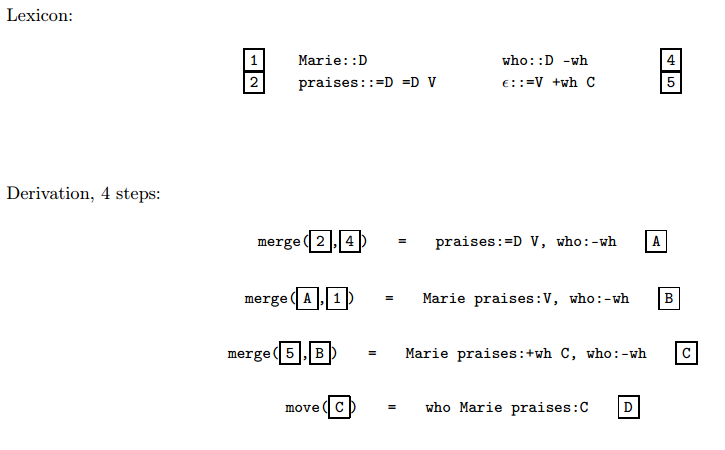
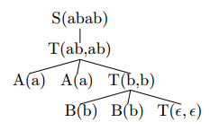
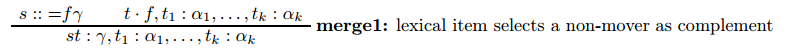
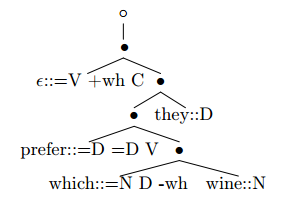
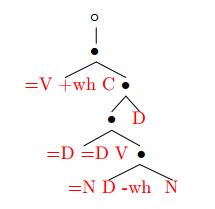
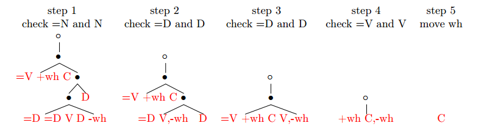

# Mildly context sensitive languages

Some human languages are not context free:

* Crossing dependencies in Swiss German and Dutch. *Respectively* in English
* Whole word reduplucation in Bambara
* Scrambling in some dialects of German
* Full phrase reduplication: English X-or-no-X, Chinese A-not-A questions

Furthermore, reasonable grammars of human languages cannot be context free, in the sense that context free grammars are not able to state certain insightful generalizations, and their representations are less compact (Chomsky 1956 and others).

# Minimalist Grammars

Three types of trees:

* X' trees
* Bare trees
* Derivation trees [later]

Bare trees are generated by MGs, and can be deterministically converted into X' trees.

**Definition of a Minimalist Grammar.** A minimalist grammar G is a pair (**Lexicon**, {**merge**, **move**})

* Vocabulary $$\Sigma$$ = {`every`, `some`, `student`, ...}
* Types $$T$$ = {`::`, `:`}
* Syntactic features $$F$$:
    * Selectees: `C, T, D, N, V, P, ...`
    * Selectors: `=C, =T, =D, =N, =V, =P, ...`
    * Licensors: `+wh, +case, +focus, ...`
    * Licensees: `-wh, -case, -focus, ...`
* Expressions $$E$$: trees with non-leaf nodes {<, >}, leaves $$\Sigma* \times T \times F*$$
* Lexicon **Lexicon** $$\subset \Sigma* \times \{::\} \times F*$$, a finite set of 1-node trees

**Notation.**

* $$t[f]$$ is a tree with 1st feature $$f$$ at its head, and the tree $$t$$ is the result of removing $$f$$ and changing `::` to `:`.
* $$t\{t_1/t_2\}$$ is the result of replacing $$t_1$$ by $$t_2$$ in $$t$$.
* $$t_1^>$$ is the maximal projection of the head of $$t_1$$.
* $$\epsilon$$ is the 1-node tree labelled with no syntactic or phonetic features.

**Structure building operations.** Define **merge** and **move**:

**Remarks.**

* Each structure building operation checks (cancels) a pair of features.
* Features in a sequence are cancelled from left to right.
* The first selectee is merged on the right of its head (complement), and all the rest are merged to the left of its head (specifiers).
* All movement is overt, phrasal, and leftward.
* The restriction on **move** implements a strong version of the shortest move condition, prevents movement when there are two items competing for the same feature.

**Example.** A grammar with a transitive verb, wh-movement, and coordination. This grammar generates an infinite language.

**Other examples.**

* A simplified version of Mahajan's proposal for SOVI order in Tamil.
* A formalization of some of the ideas in Baker (2003).
* A grammar for the copy language $$L_{xx} = \{xx : x \in \{a, b\}^+\}$$.

# Simplified MG trees

The structure building operations only need to see:

* The features of the head.
* Any subconstituent that has yet to move.
* The linear order of the strings dominated by the tree(s) (the yield/spellout)

We simplify our derivation in this way:

* Trees are replaced by tuples of categorized strings.
* Each categorized string is called a *chain*.
* The tuples of chains have the format $$\alpha, \mu_1, \ldots, \mu_n$$ where $$\alpha$$ represents the head and each $$\mu_i$$ is a subconstituent that has to move.
* Differentiate two subcases of **merge**: one which merges an item which has unchecked licensee features (a mover), and one which doesn't.

**Example.** The example derivation above, reformulated:

**Reformulation of a Minimalist Grammar.**
A minimalist grammar G is a pair (**Lexicon**, {**move**, **merge**}):

* Vocabulary $$\Sigma$$ = {`every`, `some`, `student`, ...}
* Types $$T$$ = {`::`, `:`}
* Syntactic features $$F$$:
    * Selectees: `C, T, D, N, V, P, ...`
    * Selectors: `=C, =T, =D, =N, =V, =P, ...`
    * Licensors: `+wh, +case, +focus, ...`
    * Licensees: `-wh, -case, -focus, ...`
* Chains $$C = \Sigma* \land T \land F*$$
* Expressions $$E = C*$$
* Lexicon **Lexicon** $$\subset \Sigma* \times \{::\} \times F*$$, a finite set of 1-node trees
* Structure building operations:
    * **merge**: $$(E \times E) \to E$$ is the union of the following three functions. For any $$\cdot \in \{:, ::\}, \gamma \in F*, \delta \in F^+$$ and any chains $$\alpha_1, \ldots, \alpha_k, \iota_1, \ldots, \iota_l$$ (where $$0 \leq k, l$$):

        

    * **move**: $$E \to E$$ is the union of the following two functions. For any $$\gamma \in F*, \delta \in F^+$$, satisfying the following condition:

        (SMC) none of the chains $$\alpha_1, \ldots, \alpha_{i-1}, \alpha_{i+1}, \ldots, \alpha_k$$ has $$-f$$ as its first feature.

        

**Some definitions.**

* Structures $$S(G)$$ = closure($$G$$)
* Completed structures $$CS(G) = \{w \cdot C \in S(G) \text{ for some } \cdot \in \{:, ::\}\}$$, for $$C$$ the start category.
* Sentences $$L(G) = \{w : w \cdot C \in S(G), \text{ for some } \cdot \in \{:, ::\}\}$$, the strings of category $$C$$.

**MCFGs**

- We can think of Context free rules, like S $$\to$$ DP VP,
as an implication: if $$x$$ is a DP and $$y$$ is a VP then $$xy$$ is an S.
- So we might rewrite that rule like this:

    S(xy) $$\leftarrow$$ DP(x) VP(y)

- Terminal rules, like D $$\to$$ the,
are like axioms.
- So can be rewritten like this:

    D(the) $$\leftarrow$$

- MCFGs use this kind of notation. **Example.** The copy language $$L_{xx}$$:

    S(xy) $$\leftarrow$$ T(x, y)  
    T($$\epsilon$$, $$\epsilon$$) $$\leftarrow$$  
    T(xz, yw) $$\leftarrow$$ A(x) A(y) T(z, w)  
    T(xz, yw) $$\leftarrow$$ B(x) B(y) T(z, w)  
    A(a) $$\leftarrow$$   
    B(a) $$\leftarrow$$

- **Example.** Derived tree for 'aabb' $$\in L_{xx}$$:

    

**Definition.**
An MCFG is a 4-tuple $$G = \langle \Sigma, N, P, S\rangle$$ with an infinite set of variables $$X$$, where:

- $$\Sigma$$ is a finite nonempty set of vocabulary elements
- $$N$$ is a finite nonempty set of categories $$A$$, where each has dimension $$dim(A) > 0$$
- $$P$$ is a set of rules of the following form, for $$n \geq 0$$:

    $$B_0(\alpha_1, \ldots, \alpha_{k_0}) \leftarrow
    B_1(x_{1,1}, \ldots, x_{1,k_1}) \ldots B_n(x_{n, 1}, \ldots, x_{n, k_n})$$

    where

    - For each $$0 \leq i \leq n$$, $$\dim(B_i) = k_i$$
    - Each $$x_{i,j}$$ is a variable
    - Each $$\alpha_i \in (\Sigma \cup X)*$$
    - Each variable occurs at most once on the right, and at most once on the left.
    - All variables on the left appear on the right
- $$S \in N$$ is the start category, with $$dim(S) = 1$$

**Remark.** An MCFG in which every category $$A$$ has $$dim(A) = 1$$ is a CFG.

**Theorem.**
MCFGs and MGs are weakly equivalent. In fact, they are strongly equivalent in the sense that there is an isomorphism between the two  grammars derivations.

*Example of Isomorphism.* The rule **merge1**

can be translated into the following MCFG rule schema:

$$\gamma, \alpha_1, \ldots, \alpha_k: (st, t_1, \ldots, t_k) \leftarrow {=f\gamma :: (s)} \quad f, \alpha_1, \ldots, \alpha_k(t, t_1, \ldots, t_k)$$

# Derivations

We can depict the MG derivation that produces the derived trees on the right with the **derivation tree** on the left:

**Properties.**

- MG derivation tree languages are finite-state recognizable (i.e., we can define a regular acceptor for them) [below].
- A derivation tree can be transformed into a bare tree with a deterministic multi bottom-up tree transduction [see p. 120].

## A bottom-up finite-state tree acceptor

A tree acceptor is defined by a 4-tuple $$M = (\Sigma, Q, F, \delta)$$ where

- $$\Sigma$$ is a ranked alphabet
- $$Q$$ is a set of states of rank 0 (the leaves of the tree)
- $$F \subseteq Q$$ is the set of final states
- $$\delta$$ is a set of rules of the form

    $$ f(q_1, \ldots, q_n) \to q $$

    where $$f \in \Sigma$$ has rank $$n$$ and $$q_1, \ldots, q_n, q \in Q$$

The rewrite relation $$\to$$ introduces states into the trees as new leaves.
Intuitively, to accept a tree $$T$$, we proceed from the bottom up through $$T$$, replacing nodes successively as determined by the rules $$\delta$$.

See p. 118 for an example.

## Accepting MG derivation trees

MG derivation trees are defined by the grammar $$G = (\Sigma, F, \textbf{Lexicon}, C, \bullet, \circ)$$
For our tree acceptor $$M = (\Sigma, Q, F, \delta)$$ we let:

- Ranked alphabet $$\Sigma = \bullet^2, \circ^1, l^0$$ for every $$l \in \textbf{Lexicon}$$
- States $$Q = (\alpha, \mu)$$, where $$\alpha$$ is the sequence of head features and $$\mu$$ is a (possibly empty) sequence of licencee features (movers).
- Final states $$F = \{C\}$$, the start category
- Rules $$\delta$$ are defined by the following rule schemas. Let
    - $$w$$ be any sequence of vocabulary elements in the lexicon ($$w \in \Sigma+$$)
    - $$\alpha, \beta$$ are nonempty sequences of features ($$\alpha, \beta \in F*$$)
    - $$\mu_1, \mu_2$$ are sets of sequences of licensee features ($$\mu_1, \mu_2 \in \{-f \in F\}*$$)

Then our rule schemas are:

   (lex)       $$w :: \alpha() \to \alpha$$ [for each $$w :: \alpha \in G$$]  
   (merge1,2)  $$\bullet((=x \alpha, \mu_1), (x, \mu_2)) \to (\alpha, \mu_1 \cup \mu_2)$$  
   (merge2)    $$\bullet((=x \alpha), (\mu_1, x\beta, \mu_2)) \to (\alpha, \{\beta\} \cup \mu_1 \cup \mu_2)$$  
   (move1)     $$\circ((+x \alpha, \mu_1 \cup \{-x\})) \to (\alpha, \mu_1)$$  [if SMC]  
   (move2)     $$\circ((+x \alpha, \mu_1 \cup \{-x\beta\})) \to (\alpha, \mu_1 \cup \{\beta\})$$ [if SMC]

**Intuition.**

- (lex) replaces each leaf with its syntactic features
- The other rules carry out the structure building operations, replacing each intermediate node with a tuple of sequences of features representing the unchecked features left over
- The tree is accepted once we reach the top node, and rewrite it as just \texttt{C}.

**Example.**
We want to accept this derivation tree:

Apply rule (lex):

Apply the other rules bottom-up:

