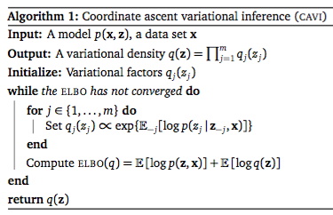

Deriving Variational Updates
============================

The Coordinate Ascent Algorithm
--------------------------------

The lower bound that we've derived above is a good start, but it means nothing if we cannot use it to converge on a solution. All it tells us right now is that given a certain variational distribution $$q(Z)$$ we can compute the lower bound on the log marginal likelihood. If we were incredibly lucky, we might guess this distribution on the first try and be done, but barring this astronomically unlikely event, we will need to update our variational distribution in some iterative manner. 

Mean Field Approximation 
------------------------
The first problem with finding $$q$$ is that it is a distribution over all latent variables $$Z$$. Since it is often the strong conditional relationships between latent variables that make inference intractable, we need to find a way to simplify the problem. Intuitively, $$q$$ is an approximation (recall that L(q) is a lower bound, not an equality relation). Since we plan on improving $$q$$ through updates, it turns out we can get away with breaking these interdependencies and proposing a variational distribution $$q_i(z_i)$$ for all $$z_i \in Z$$. Since we treat each variational distribution over a latent variable as independent, we get 

$$q(Z) = \prod\limits_{i} q_i(z_i)$$

This is a very powerful assumption, because it allows us to optimize each variational distribution iteratively. That is to say, while holding all other variational distributions constant, we will find the variational parameters for $$q_i(z_i)$$ that maximize the marginal likelihood. Recall that our bound on the log marginal likelihood was:

$$L(q) \geq \sum\limits_{z_i \in Z} q(Z) \log\ p(X,Z|\Phi) + H(q)$$

For the sake of concise notation, let $$q_j = q_j{Z_j}$$ and let us disregard the conditioner $$\Phi$$ for now. Let's replace $$q(Z)$$ with our approximating product:

$$\begin{aligned} L(q) \geq \sum\limits_{z_i \in Z} \left( \prod\limits_{i} q_i(z_i) \right) \log\ p(X,Z|\Phi) + H(q) \\
L(q) \geq \mathbb{E}_{ \prod\limits_{i} q_i(z_i) } \log\ p(X,Z|\Phi) [\log\ p(X,Z|\Phi)] + H(q)
\end{aligned}$$

Using the chain rule and expanding the entropy term, we can rewrite this expression as

$$\begin{aligned} \log\ p(X|\Phi) + \sum\limits_{i=1}^{| Z|} \mathbb{E}_q [\log\ p(z_i | X, z_1,..., z_{i-1}, \Phi)] - \sum\limits_{i=1}^{| Z|} \mathbb{E}_q[\log\ q_{\nu_i}(z_i)] \end{aligned}$$

Since $$p(X \vert Phi)$$ does not depend on the variational parameter $$\nu_i$$ we can ignore it (recall that this is a lower bound, not an exact equality, so generally $$X \geq A+B \land A,B \geq 0 \Rightarrow X \geq B \land X \geq A$$). Since $$Z$$ is a set, we can reorder its elements any way we wish. If we reorder them each time so that $$z_i$$ comes last, we can say:

$$\begin{aligned} \mathcal{l}_i = \mathbb{E}_q[\log\ p(z_i| Z_{-i}, X, \Phi)] - \mathbb{E}_q[\log\ q_{\nu_i}(z_i)]
\end{aligned}$$

Note that for any exponential family distribution $$q_{\nu_i}$$, 

$$q_{\nu_i}(z_i) = h(z_i) \exp \big\{ \nu_i^{T} z_i - a(\nu_i) \big\} $$

where $$a(\nu_i)$$ is the cumulant function, which for the first three derivatives is equivalent to the corresponding derivatives of the moment generating function. We can rewrite our equation using this form for $$q_{\nu_i}(z_i)$$:

$$\begin{aligned} \mathcal{l}_i = \mathbb{E}_q[\log\ p(z_i| Z_{-i}, X, \Phi)] - \mathbb{E}_q\bigg[\log\ \Big( h(z_i) \exp \big\{ \nu_i^{T} z_i - a(\nu_i) \big\} \Big) \bigg] \\
= \mathbb{E}_q[\log\ p(z_i| Z_{-i}, X, \Phi)] -  \mathbb{E}_q\bigg[\log\ \left( h(z_i))\right) + \nu_i^{T} z_i - a(\nu_i) \bigg] \\
= \mathbb{E}_q[\log\ p(z_i| Z_{-i}, X, \Phi)] -  \mathbb{E}_q\big[\log\ \left( h(z_i))\right)\big] - \mathbb{E}_q[\nu_i^T z_i]  + \mathbb{E}_q[a(\nu_i)] \\
= \mathbb{E}_q[\log\ p(z_i| Z_{-i}, X, \Phi)] -  \mathbb{E}_q\big[\log\ \left( h(z_i))\right)\big] - \nu_i^T a'(\nu_i) + a(\nu_i)
\end{aligned}$$ 

Note that $$\mathbb{E}_q[\nu_i^Tz_i] = \nu_i^T a'(\nu_i)$$ becomes since $$E_q(\z_i) = a'(\nu_i)$$ and $$\nu_i^T$$ factors out as a constant when taking the expectation with respect to $$q$$. The main premise of variational inference is to cast the intractable calculation of the posterior as an optimization problem. In most optimization problems, there are two general steps: 1) computing an objective function which will allow us to 2) optimize the function by adjusting the parameters. So far, we have an objective function (our lower bound $$\mathcal{L}(q)$$ on the marginal likelihood). In order to optimize it, we will use some calculus to find the maximum. Setting the first derivative to $$0$$ and solving allows us to obtain a point where the slope of the function has leveled out. With a strictly convex function, this will be the global maximum. However, in most real-life scenarios, the objective function is not strictly convex. This means that the result could very well be a **local** maximum. Converging on local maxima is one of the risks run when using variational inference. 

In the general case, taking the derivative of the objective function can be costly, especially since it must be done every time we want to update our parameters and for every parameter in the factorized representation of the variational distribution. However, using exponential family random variables will allow us to leverage some convenient mathematical facts and avoid this computation.

We are trying to optimize the function by adjusting the variational parameters, so we take the partial derivative of our function with respect to $$\nu_i$$: 

$$\begin{aligned}
\frac{\delta}{\delta \nu_i} \mathcal{l}_i = \frac{\delta}{\delta \nu_i} \left( \mathbb{E}_q[\log\ p(z_i| Z_{-i}, X, \Phi)] -  \mathbb{E}_q\big[\log\ \left( h(z_i))\right)\big] - \nu_i^T a'(\nu_i) + a(\nu_i) \right) \\
= \frac{\delta}{\delta \nu_i} \left( \mathbb{E}_q[\log\ p(z_i| Z_{-i}, X, \Phi)] -  \mathbb{E}_q[\log\ h(z_i))] \right) - \left(\nu_i^Ta''(\nu_i)  + a''(\nu_i)\right) + a''(\nu_i) \\
= \frac{\delta}{\delta \nu_i} \left( \mathbb{E}_q[\log\ p(z_i| Z_{-i}, X, \Phi)] -  \mathbb{E}_q[\log\ h(z_i))] \right) - \nu_i^Ta''(\nu_i)
\end{aligned}$$

Setting this to $$0$$ we get:

$$\begin{aligned}
0 = \frac{\delta}{\delta \nu_i} \left( \mathbb{E}_q[\log\ p(z_i| Z_{-i}, X, \Phi)] -  \mathbb{E}_q[\log\ h(z_i))] \right) - \nu_i^Ta''(\nu_i) \\
\nu_i^Ta''(\nu_i) = \frac{\delta}{\delta \nu_i} \left( \mathbb{E}_q[\log\ p(z_i| Z_{-i}, X, \Phi)] -  \mathbb{E}_q[\log\ h(z_i))] \right)\\
\nu_i =  \left( \frac{\delta}{\delta \nu_i} \mathbb{E}_q[\log\ p(z_i| Z_{-i}, X, \Phi)] -  \frac{\delta}{\delta \nu_i} \mathbb{E}_q[\log\ h(z_i))] \right) \left(a''(\nu_i)\right)^{-1}
\end{aligned}$$

Recall that for this to work, $$q$$ must be in the exponential family. Similarly, if $$p(z_i\vert Z_{-i}, X, \Phi)$$ is a member of the exponential family, it can be rewritten:

$$\begin{aligned}
p(z_i| Z_{-i}, X, \Phi) = h(z_i) \exp\big\{g_i(Z_{-i}, X, \Phi)^Tz_i - a\left(g_i(Z_{-i}, X, \Phi)\right) \big\}
\end{aligned}$$

where $$g_i(Z_{-i}, X, \Phi)$$ is the natural parameter of distribution $$p$$ (for exponential family distributions, this natural parameter has already been defined). Plugging this in for $$ p(z_i\vert Z_{-i}, X, \Phi) $$ (first in the expected value alone, for the sake of readability) and taking the derivative we get:

$$\begin{aligned}
\mathbb{E}_q [\log\ p(z_i| Z_{-i}, X, \Phi)] = \mathbb{E}_q [\log\ h(z_i)] + \mathbb{E}_q[g_i(Z_{-i}, X, \Phi)]^Ta'(\nu_i) - \mathbb{E}_q \big[a\left(g_i(Z_{-i}, X, \Phi)\right) \big]\\
\frac{\delta}{\delta \nu_i} \mathbb{E}_q [p(z_i| Z_{-i}, X, \Phi)] =  \frac{\delta}{\delta \nu_i} \mathbb{E}_q [\log\ h(z_i)] 
    + \bigg( \frac{\delta}{\delta \nu_i}\left( \mathbb{E}_q[g_i(Z_{-i}, X, \Phi)]^T \right) a'(\nu_i)  
    + \mathbb{E}_q[g_i(Z_{-i}, X, \Phi)]^T a''(\nu_i) \bigg) \\ - \frac{\delta}{\delta \nu_i} \mathbb{E}_q \big[a\left(g_i(Z_{-i}, X, \Phi)\right) \big]\\
= \frac{\delta}{\delta \nu_i} \mathbb{E}_q [\log\ h(z_i)] + \mathbb{E}_q[g_i(Z_{-i}, X, \Phi)]^Ta''(\nu_i) 
\end{aligned}$$

Note that many of the expectations drop out; when differentiating with respect to one variable, if a function or value is not written in terms of that variable, then it is treated as a constant and drops out to $$0$$. Substituting $$\frac{\delta}{\delta \nu_i} \left( \mathbb{E}_q[\log\ p(z_i \vert Z_{-i}, X, \Phi)] \right)$$ for this in our first differentiation, we get:

$$\begin{aligned}
\nu_i = \left( \frac{\delta}{\delta \nu_i} \mathbb{E}_q [\log\ h(z_i)] + \mathbb{E}_q[g_i(Z_{-i}, X, \Phi)]^Ta''(\nu_i) -  \frac{\delta}{\delta \nu_i} \mathbb{E}_q[\log\ h(z_i))] \right) \left(a''(\nu_i)\right)^{-1} \\
=  \left( \mathbb{E}_q[g_i(Z_{-i}, X, \Phi)]^Ta''(\nu_i) \right) \left(a''(\nu_i)\right)^{-1} \\
= \mathbb{E}_q[g_i(Z_{-i}, X, \Phi)]
\end{aligned}$$

So the optimal value (when the derivative is $$0$$) of $$\nu_i = \mathbb{E}_q[g_i(Z_{-i}, X, \Phi)]$$. Since we have a closed form for the natural parameters of exponential family equations, we can compute this expectation without having to do the costly differentiation normally required to obtain the gradient of a function. 

<!-- 
Choosing any one $$q_j(z_j)$$ to optimize (remembering also that $$Z_j$$ can be a subset of $$Z$$, not just one element), we can rewrite this as:

$$\sum\limits_{z\in Z_j} (q_j(z) \sum\limits_{z_i \in Z_{-j}} \prod\limits_{i\neq j} q_i \log\ p(X, z) ) - \sum\limits_{z\in Z_j} q_j \log\ q_j + const$$ 

where $$Z_{_j}$$ means all $$z_i \in Z$$ where $$ i\neq j$$

Let

 $$ \log\ \tilde{p}(x,z_j) = \mathbb{E}_{-j}[\log\ p(X,Z)] + const$$

where 

$$\mathbb{E}_{-j}[\log\ p(X,Z)] = \sum\limits_{z\in Z_j} \log\ p(X,Z) \prod\limits_{i\neq j} q_i $$

Then the equation above is the negative KL divergence between $$q_j(Z_j)$$ and $$\tilde{p}(X, Z_j)$$, which we can minimize. Clearly, the minimum value for this will be reached when $$q_j(Z_j) = \tilde{p}(X, Z_j)$$. Let $$q^{*}_j(Z_j)$$ be this optimal solution. Then 

$$\log\ q^{*}_j(Z_j) = \mathbb{E}_{-j}[\log\ p(X,Z)] + const$$
@bishop2006pattern

Adding back in our conditioner $$\Phi$$ (the model parameters), the right can be rewritten:
 
$$\mathbb{E}_{-j}[\log\ p(X,Z | \Phi)] + const $$ 
$$= \mathbb{E}_{-j}[\log\ p(Z_j, Z_{-j}, X | \Phi)] + const$$ 
$$ = \mathbb{E}_{-j}[\log\ p(Z_j|Z_{-j},X,\Phi)p(Z_{-j}|X, \Phi)] + const$$ 
$$ = \mathbb{E}_{-j}[\log\ p(Z_j|Z_{-j}, X,\Phi)] +  \mathbb{E}_{-j}[\log\ p(Z_{-j}|X, \Phi)] + const$$ 
 -->

<!-- Question 2: is this the reason why we do this? Bishop uses equality and the second expectation ($$\mathbb{E}_{-j}[\log\ p(Z_{-j}|X, \Phi)]$$) but the other papers (Blei, Cohen) use proportionality and drop the second expectation 

We're interested in updating $$q_j(Z_j)$$, but to do so we need to hold $$q_{-j}(Z_{-j})$$ constant, so we are going to generalize this formula to say:

$$ q^*_j(Z_j) \propto \exp\{\mathbb{E}_{-j}[\log\ p(Z_j|Z_{-j}, X,\Phi)]\}$$

The pseudocode for the Coordinate Ascent Variational Inference algorithm (CAVI) helps illustrate this process:

 -->
